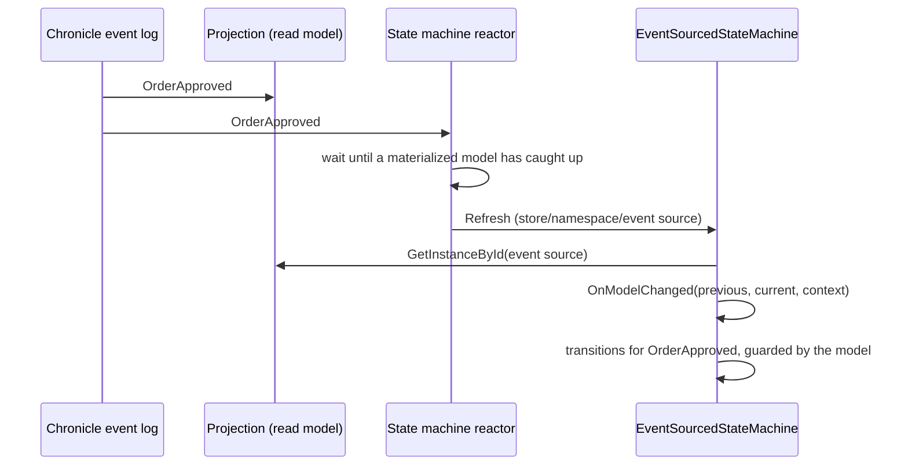

A grain that follows a business process - an order that is placed, approved and shipped, a ticket that is opened,
assigned and resolved - usually ends up keeping its own copy of what the events already say. It persists a status,
subscribes to the events that should change it, and hopes the two never disagree. When a handler fails halfway, or
the grain storage is restored from a different point in time than the event log, they do disagree, and nothing tells
you which one is right.

`EventSourcedStateMachine<TModel>` in the `Cratis.Orleans.Chronicle` package removes the copy. The events in Chronicle
are the only source of truth. The model is a Chronicle read model projected from them, the grain only ever reads it,
and the state machine's current state is derived from the model every time the grain activates. Events the state
machine is interested in are delivered to it, the model is re-read, and the transitions you declare for the event
decide where it goes next.



## Define a state machine

A state machine names its model, its states and the transitions events drive. The model is an ordinary Chronicle
read model - this one uses model-bound projection attributes, and is passive, which is the recommended choice for a
state machine (see [Read model lag](#read-model-lag)):

```csharp
using Cratis.Chronicle.Events;
using Cratis.Chronicle.Projections.ModelBound;
using Cratis.Chronicle.ReadModels;

[EventType]
public record OrderPlaced(string Customer);

[EventType]
public record OrderApproved;

[EventType]
public record OrderShipped;

public enum OrderStatus
{
    Placed = 0,
    Approved = 1,
    Shipped = 2
}

[Passive]
[FromEvent<OrderPlaced>]
public record Order(
    string Customer,
    [SetValue<OrderApproved>(OrderStatus.Approved)]
    [SetValue<OrderShipped>(OrderStatus.Shipped)]
    OrderStatus Status);
```

The states are the same `State<TStoredState>` types any [state machine](state-machines.md) uses, with the model as
the stored state:

```csharp
using System.Collections.Immutable;
using Cratis.Orleans.StateMachines;

public class Placed : State<Order>
{
    protected override IImmutableList<Type> AllowedTransitions => [typeof(Approved)];
}

public class Approved : State<Order>
{
    protected override IImmutableList<Type> AllowedTransitions => [typeof(Shipped)];
}

public class Shipped : State<Order>;
```

The grain derives `EventSourcedStateMachine<TModel>`. Its grain interface derives `IEventSourcedStateMachine`, which
is a string-keyed grain interface:

```csharp
using System.Collections.Immutable;
using Cratis.Orleans.Chronicle.StateMachines;
using Cratis.Orleans.StateMachines;

public interface IOrderProcess : IEventSourcedStateMachine
{
    Task<bool> CanBeShipped();
}

public class OrderProcess : EventSourcedStateMachine<Order>, IOrderProcess
{
    protected override Type InitialState => typeof(Placed);

    public override IImmutableList<IState<Order>> CreateStates() => [new Placed(), new Approved(), new Shipped()];

    public async Task<bool> CanBeShipped() => await GetCurrentState() is Approved;

    protected override void DefineTransitions(IStateMachineTransitions<Order> transitions) => transitions
        .On<OrderApproved>().When(order => order.Customer.Length > 0).TransitionTo<Approved>()
        .On<OrderShipped>().TransitionTo<Shipped>();

    protected override Type ResolveState(Order? model) => model?.Status switch
    {
        OrderStatus.Approved => typeof(Approved),
        OrderStatus.Shipped => typeof(Shipped),
        _ => InitialState
    };
}
```

There is no `[StorageProvider]` attribute and no storage to configure. The grain's storage reads the model through
Chronicle and never writes anything.

## Add it to the application

Call `AddEventSourcedStateMachines()` on the silo builder or the service collection, next to `AddCratisChronicle()`:

```csharp
using Cratis.Orleans.Chronicle.Hosting;

builder.AddCratisChronicle();
builder.Host.UseOrleans(silo => silo.AddEventSourcedStateMachines());
```

Every concrete `EventSourcedStateMachine<TModel>` type discovery finds is inspected when the Chronicle client is
created, and its artifacts are registered with Chronicle's explicit registration API, so they reach every event store
and namespace the client connects:

| The model's projection | What is registered |
| --- | --- |
| The state machine overrides `DefineProjection` | That projection |
| The model carries model-bound projection attributes Chronicle has not discovered | The model-bound read model |
| Chronicle already discovered a projection for the model | Nothing - it is not registered twice |

A state machine that overrides `DefineProjection` for a model Chronicle already has a projection for fails client
creation with `StateMachineModelAlreadyHasProjection`; one without any projection fails with
`MissingProjectionForStateMachineModel`. Failing at startup is deliberate: a state machine that silently never
refreshes is far harder to find.

Then **one reactor per state machine** is registered. It subscribes to exactly the event types the state machine is
interested in - the events its projection consumes (from, join, removed with, children and nested) together with the
events its transitions are declared for, with interfaces and base types expanded to the event types implementing
them. It never subscribes to all events.

To register only some state machines, turn discovery off and list them:

```csharp
silo.AddEventSourcedStateMachines(options =>
{
    options.Discover = false;
    options.StateMachines.Add(typeof(OrderProcess));
});
```

### Describe the state machine from its type alone

`DefineProjection` and `DefineTransitions` are called at startup on an instance created without running any
constructor, so the integration can learn which events the state machine needs before any grain exists. They must
not use fields, constructor parameters or injected services - only the builder they are given.

## Define the projection in code

When the model has no model-bound attributes, describe its projection in `DefineProjection`. It is the same builder an
`IProjectionFor<TModel>` gets:

```csharp
protected override void DefineProjection(IProjectionBuilderFor<Ticket> projection) => projection
    .Passive()
    .From<TicketOpened>()
    .From<TicketAssigned>()
    .From<TicketResolved>(_ => _.Set(ticket => ticket.Resolved).ToValue(true));
```

## What happens when an event is delivered

1. The reactor finds the grain for the event's event store, namespace and event source.
2. The grain re-reads the model through `IReadModels.GetInstanceById`.
3. `OnModelChanged(previous, current, context)` is called with the model before and after the event and the event's
   `EventContext`. Either model is `null` while there is no instance.
4. The transitions declared for the event type are evaluated in declaration order against the refreshed model. The
   first whose guards are satisfied and that the current state allows - through `CanTransitionTo` - is taken. A
   guarded transition is never taken while the model has no instance.

Nothing about the current state is persisted. When the grain activates, `ResolveState(model)` - by default
`InitialState` - decides the state it enters, so the state after a restart, a deactivation or a move to another silo
is always what the authoritative model says. Make `ResolveState` agree with your transitions, because it is what the
state machine becomes the next time it activates.

## Grain keys and namespaces

A state machine's grain key is a `StateMachineKey`: `{eventStore}/{namespace}/{eventSourceId}`. The event store and
namespace are part of the key, so the same event source in two namespaces - two tenants - is two grains, and each
reads its model from its own namespace. The event source id may contain `/`; the event store name and namespace may
not.

Get a state machine from application code with the `IGrainFactory` extensions:

```csharp
using Cratis.Chronicle;
using Cratis.Orleans.Chronicle.StateMachines;

public class OrderShipping(IGrainFactory grainFactory, IEventStore eventStore)
{
    public Task<bool> CanBeShipped(string orderId) =>
        grainFactory.GetEventSourcedStateMachine<IOrderProcess>(eventStore, orderId).CanBeShipped();
}
```

Passing the request's tenant-resolved `IEventStore` picks the namespace it is bound to. There are overloads taking an
explicit `EventStoreName`, event source id and optional namespace (the default namespace when omitted), and one taking
a `StateMachineKey`.

The grain reaches Chronicle through `IStateMachineEventStores`, which asks `IChronicleClient` for the event store of
the namespace in its key. It never uses a scoped, request-resolved `IEventStore`, because a grain has no request.

## Read model lag

A **passive** model is computed from the event log when it is read, so it always includes the event that was just
delivered. That is why passive models are recommended for state machines.

A **materialized** model is written by its projection's own observer, which may not have handled the delivered event
yet. Before refreshing the grain for an event the projection consumes, the reactor waits until the projection has
handled the event's sequence number. If it has not within `ModelCatchUpTimeout` (30 seconds by default), the delivery
fails with `ModelDidNotCatchUp` and Chronicle retries the partition - a stale model never decides a transition. An
event only the transitions use is not waited for: the projection never handles it, and events reach the reactor in
order per event source, so every projected event before it has already been waited for.

## When it is the wrong fit

- **A process that decides, rather than follows.** Transitions here react to facts that already happened. When the
  grain must accept or reject a command, validate it where the event is appended - a command or a constraint - and
  let the state machine follow the outcome.
- **State that is not derived from events.** Use a [state machine](state-machines.md) with its own storage.
- **Work that must happen exactly once per event.** `OnModelChanged` and `OnEnter` can run again when Chronicle
  redelivers an event after a failure or a replay. Make side effects idempotent, or use a reactor built for them.
