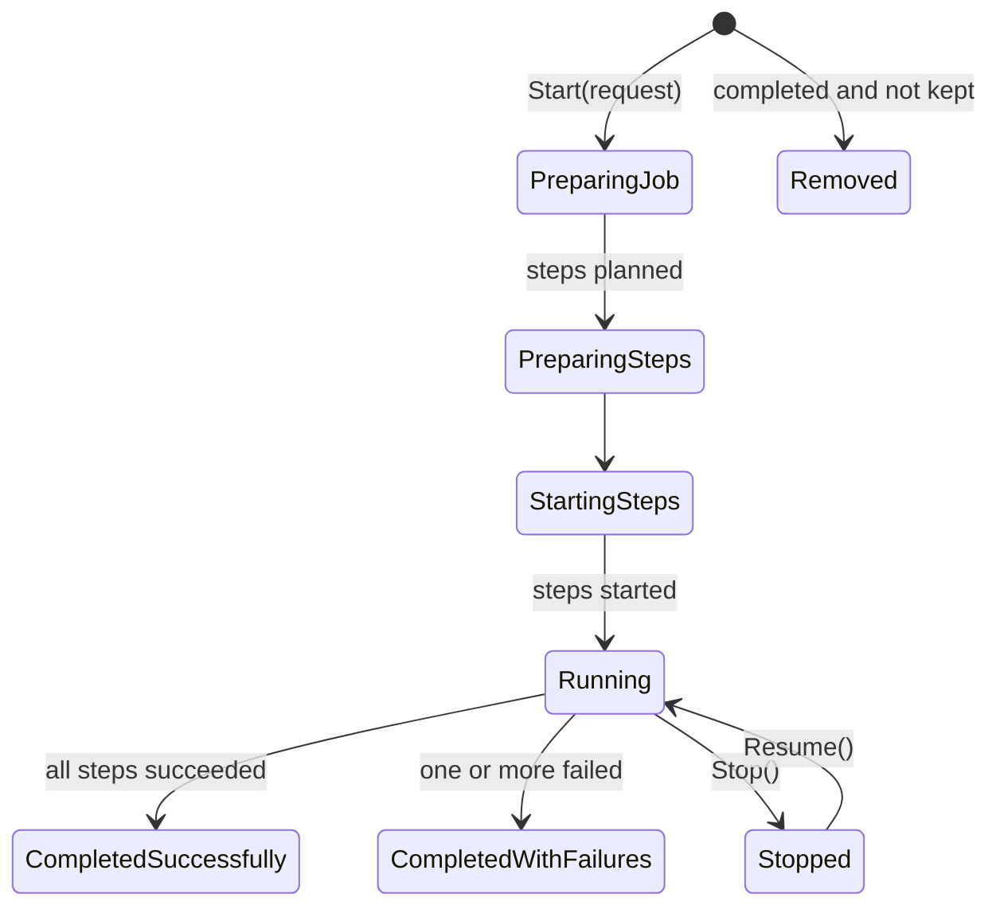

# The job system

A **job** is work that outlives a request: a replay, a migration, a provisioning pass - anything that must
survive the process going away while it runs. A job **plans** what it will do, then performs the plan as
**steps**, each step its own Orleans grain.



## Planning is separate from performing

`PrepareSteps` says what a job will do before any of it happens. That is what lets somebody watch progress
rather than a spinner: the total is known up front, and each step reports its own outcome as it finishes.

## Steps are grains

Each step runs as an independent grain activation, so slow or hanging steps cannot stall each other or the
job's own bookkeeping, and steps run in parallel - bounded by the throttle. The step reports back to the job
grain; the job counts outcomes, never performs the work itself.

## A step may be performed twice

The grain counts a step only once it has finished with it, so a step that was in flight when the host went
down is performed again on resume. A performer must tolerate being asked twice; anything that must not happen
twice belongs behind a check the performer itself makes. Progress checkpoints are debounced (see
[Options](../reference/options.md)), so a crash between checkpoints re-delivers every batch handled since -
an at-least-once relaxation, not a free one.

## One failed step does not abandon the rest

A job that could not do one piece of work has still done the others, and the job's history says which was
which. A failed step fails the job's completion status - it never fails the application: the failure is
recorded state, not an exception on anybody's startup path.

## Stages order steps that depend on each other

Steps are independent by default, and that is the shape to prefer: every step starts at once and the throttle
decides how many run. Some jobs are pipelines instead, where a later step would do the wrong thing - not just
a slow thing - if it ran before an earlier one. Such a job puts its steps in **stages**:

```csharp
protected override Task<IImmutableList<JobStepDetails>> PrepareSteps(RecoveryRequest request) =>
    Task.FromResult<IImmutableList<JobStepDetails>>(
    [
        CreateStep<ISettleFinishedWork>(request, stage: 0),
        ..request.Abandoned.Select(work => CreateStep<IResumeAbandonedWork>(work, stage: 10)),
        ..request.Overrunning.Select(work => CreateStep<IStopOverrunningWork>(work, stage: 20)),
    ]);
```

- Every step in a stage reaches an outcome before any step in a later stage starts. Within a stage the steps run
  in parallel exactly as they do without stages. A job that never assigns one has every step in
  `JobStepStage.First`, which is a single stage and today's fan-out.
- Stages run in the order of their value; gaps are harmless, so numbering by tens leaves room to insert one.
- A stage is a **barrier** by default: if any of its steps fails, the job stops there. The steps in every later
  stage are recorded as `Unreachable`, count toward completion, and the job ends `CompletedWithFailures` rather
  than waiting forever for steps that will never run. Override `GetFailureBehaviorFor` to return
  `JobStageFailureBehavior.ContinueWithNextStage` for a stage that is best-effort.
- Every step is still prepared up front, so preparing a step in a later stage cannot observe what an earlier
  stage did. Read anything it needs from an earlier stage when the step is performed.
- `Start` returns once the first stage is running, and its errors describe that stage. Later stages report
  their start failures through the job.
- On resume the job picks up at the stage it had reached, and the stages behind it wait their turn.

## The job's state is its storage

What a job remembers - its status, its progress, its request - persists through the jobs storage (see
[Storage scopes](storage-scopes.md)), not through events. A completed job removes itself from storage by
default; override `KeepAfterCompleted` on the job to keep it queryable after it is done. A job that completes with
failures is kept by default so the failure stays readable. A job that runs on a short cadence would keep one record
per failed run for as long as the failure lasts, so it overrides `KeepAfterCompletedWithFailures` to let those go and
reports its failures some other way.

## Rehydration

When the silo starts, the jobs manager rehydrates every job that had not finished, and each resumes from its
persisted steps. Reminders play no part in this - which is why the hosting setup can keep reminders on the
in-memory service without costing the job system anything (see [Host the silo](../how-to/host-the-silo.md)).
