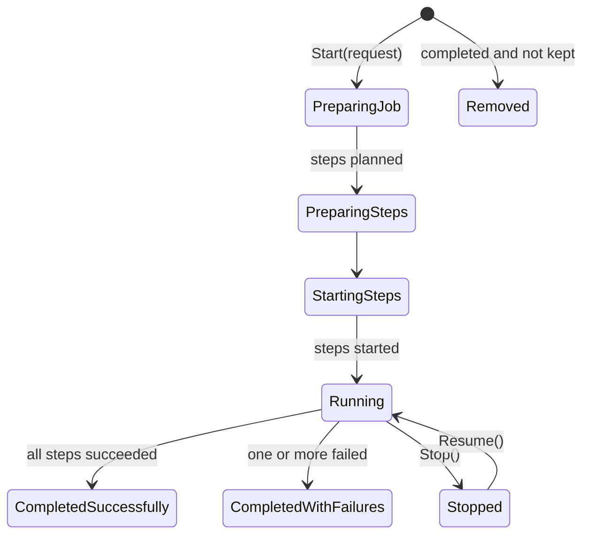

# The job system

A **job** is work that outlives a request: a replay, a migration, a provisioning pass - anything that must
survive the process going away while it runs. A job **plans** what it will do, then performs the plan as
**steps**, each step its own Orleans grain.

## Planning is separate from performing

`PrepareSteps` says what a job will do before any of it happens. That is what lets somebody watch progress
rather than a spinner: the total is known up front, and each step reports its own outcome as it finishes.

## Steps are grains

Each step runs as an independent grain activation, so slow or hanging steps cannot stall each other or the
job's own bookkeeping, and steps run in parallel - bounded by the throttle. The step reports back to the job
grain; the job counts outcomes, never performs the work itself.

## A step may be performed twice

The grain counts a step only once it has finished with it, so a step that was in flight when the host went
down is performed again on resume. A performer must tolerate being asked twice; anything that must not happen
twice belongs behind a check the performer itself makes. Progress checkpoints are debounced (see
[Options](../reference/options.md)), so a crash between checkpoints re-delivers every batch handled since -
an at-least-once relaxation, not a free one.

## One failed step does not abandon the rest

A job that could not do one piece of work has still done the others, and the job's history says which was
which. A failed step fails the job's completion status - it never fails the application: the failure is
recorded state, not an exception on anybody's startup path.

## The job's state is its storage

What a job remembers - its status, its progress, its request - persists through the jobs storage (see
[Storage scopes](storage-scopes.md)), not through events. A completed job removes itself from storage by
default; override `KeepAfterCompleted` on the job to keep it queryable after it is done.

## Rehydration

When the silo starts, the jobs manager rehydrates every job that had not finished, and each resumes from its
persisted steps. Reminders play no part in this - which is why the hosting setup can keep reminders on the
in-memory service without costing the job system anything (see [Host the silo](../how-to/host-the-silo.md)).
