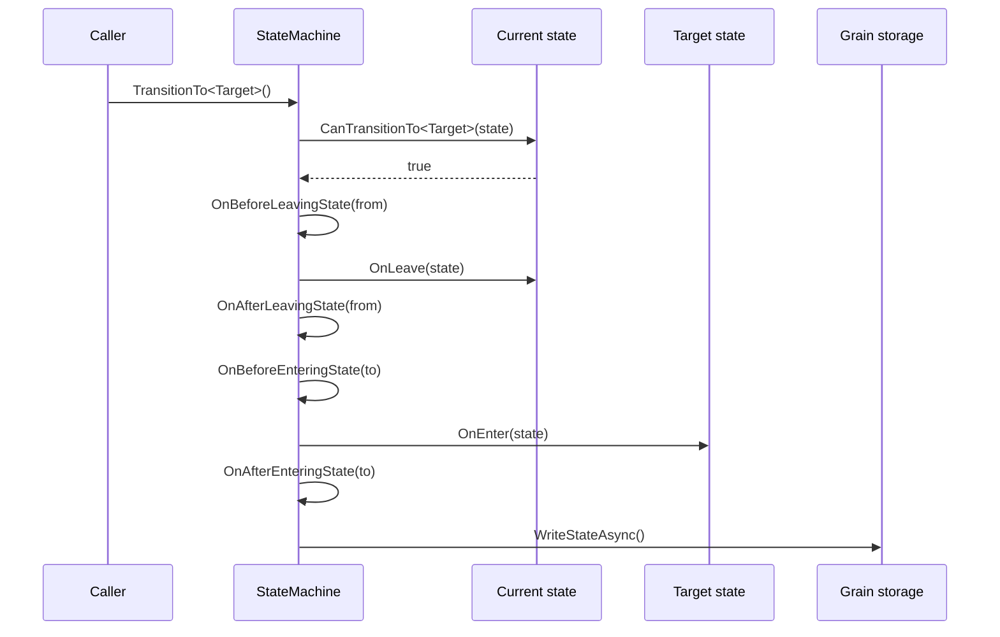

A grain with a lifecycle - a document that is drafted, published and archived, an observer that is catching up,
observing or replaying - tends to grow a status field and a thicket of `if` statements that check it. Every method
has to remember which statuses it is valid in, what to clean up when the status changes, and what to do after a
restart. Miss one check and the grain does work it should not do in the state it is in.

`StateMachine<TStoredState>` in `Cratis.Orleans.StateMachines` replaces that with explicit states. Each state is an
object that says which states it can move to and what happens when the grain enters and leaves it. The state machine
enforces the transitions, runs the enter and leave behavior in order, persists the grain state, and puts the grain
back into the state it was in when it activates again.

## The shape of a state machine

A state machine is an Orleans grain with persistent state. You derive `StateMachine<TStoredState>`, create its
states, and name the state it starts in:

```csharp
using System.Collections.Immutable;
using Cratis.Orleans.StateMachines;
using Orleans.Providers;

public class DocumentState : StateMachineState
{
    public string Title { get; set; } = string.Empty;
    public DateTimeOffset PublishedAt { get; set; }
}

public interface IDocument : IGrainWithGuidKey
{
    Task Publish();
    Task Archive();
}

[StorageProvider(ProviderName = "documents")]
public class Document : StateMachine<DocumentState>, IDocument
{
    protected override Type InitialState => typeof(Draft);

    public override IImmutableList<IState<DocumentState>> CreateStates() =>
        ImmutableList.Create<IState<DocumentState>>(new Draft(), new Published(), new Archived());

    public Task Publish() => TransitionTo<Published>();

    public Task Archive() => TransitionTo<Archived>();
}
```

A state derives `State<TStoredState>` and lists the states it allows the grain to move to:

```csharp
using System.Collections.Immutable;
using Cratis.Orleans.StateMachines;

public class Draft : State<DocumentState>
{
    protected override IImmutableList<Type> AllowedTransitions => ImmutableList.Create(typeof(Published), typeof(Archived));
}

public class Published : State<DocumentState>
{
    protected override IImmutableList<Type> AllowedTransitions => ImmutableList.Create(typeof(Archived));

    public override Task<DocumentState> OnEnter(DocumentState state)
    {
        state.PublishedAt = DateTimeOffset.UtcNow;
        return Task.FromResult(state);
    }
}

public class Archived : State<DocumentState>;
```

`Archived` allows no transitions, so once a document is archived, `Publish()` and `Archive()` do nothing. The
grain methods do not check a status; the current state decides.

## What a transition does

`TransitionTo<TState>()` asks the current state whether it may move to `TState` by calling its
`CanTransitionTo<TState>()`. The default implementation answers from `AllowedTransitions`; override
`CanTransitionTo<TTargetState>` when the answer depends on the stored state. When the answer is no, nothing happens.
When it is yes, the transition runs in this order:



`OnLeave` and `OnEnter` both receive the stored state and return it, so a state can replace the stored state
instead of mutating it. The value `OnLeave` returns is what `OnEnter` receives. The four `On…State` methods are
virtual on the state machine, for behavior that applies to every state.

| Rule | Behavior |
| --- | --- |
| The target state is not one of the states the machine created | `UnknownStateTypeInStateMachine` is thrown |
| The current state does not allow the target | Nothing happens - no leave, no enter, no write |
| A state asks for a transition while it is being entered | The transition is scheduled and runs once the current transition completes |
| A state asks for a transition while it is being left | `TransitioningDuringOnLeaveIsNotSupported` is thrown |
| `OnLeave` or `OnEnter` throws | The exception reaches the caller, a transition scheduled during it is dropped, and the machine accepts transitions again |
| The machine stays in the same state and the stored state is the same instance | The write is skipped |

The last rule matters when a state re-enters itself: mutating the stored state in place leaves the same instance, so
the change is not written. Return a new instance from `OnEnter` when a self-transition must persist.

## Persisting and restoring the current state

When the stored state derives from `StateMachineState`, the state machine records the full name of the current
state's type in `CurrentState` after every transition. On activation it enters that state again; when nothing is
recorded it enters `InitialState`. A grain with a stored state that does not derive from `StateMachineState` always
activates into `InitialState`.

Because `CurrentState` holds a type name, renaming or moving a state type changes what is recorded. A grain that
activates with a recorded name no state matches fails with `UnknownCurrentState`, so migrate the stored value when
you rename a state.

On deactivation, the state machine leaves the current state by calling its `OnLeave`, and writes the stored state.
It does not transition anywhere; the recorded current state is what the grain activates into next time.

Activation runs in this order:

1. `OnActivation` - override it to prepare anything the states need.
2. `CreateStates()` - every state deriving `State<TStoredState>` gets its `StateMachine` set, whichever assembly it is defined in.
3. `ResolveActivationState()` picks the state to enter.
4. The machine transitions into that state, running `OnEnter` as for any other transition.

## Extending the state machine

The base class has three extension points for state machines that do not keep their state in a configured grain
storage provider, or that decide transitions from data rather than from code.

### Supply the storage

The protected `StateMachine(IStorage<TStoredState> storage)` constructor gives the grain its storage directly, with
no `[StorageProvider]` attribute. Orleans does not read supplied storage as part of the grain lifecycle, so the state
machine calls `ReadStateAsync()` at the start of activation, before `OnActivation`. Every write goes to the supplied
storage.

```csharp
using System.Collections.Immutable;
using Cratis.Orleans.StateMachines;
using Orleans.Core;

public interface IExternalDocument : IGrainWithGuidKey
{
    Task Publish();
}

public class ExternalDocument(IStorage<DocumentState> storage) : StateMachine<DocumentState>(storage), IExternalDocument
{
    protected override Type InitialState => typeof(Draft);

    public override IImmutableList<IState<DocumentState>> CreateStates() =>
        ImmutableList.Create<IState<DocumentState>>(new Draft(), new Published(), new Archived());

    public Task Publish() => TransitionTo<Published>();
}
```

The storage is resolved like any other grain constructor dependency, so register an `IStorage<DocumentState>`
implementation, or have the derived constructor build one and pass it to the base constructor.

### Decide the state to activate into

Override `ResolveActivationState()` when the current state follows from the stored state itself, such as an
authoritative model, rather than from the recorded `CurrentState`:

```csharp
protected override Type ResolveActivationState() =>
    State.PublishedAt == default ? typeof(Draft) : typeof(Published);
```

The returned type must be one of the states the machine created, and it is entered through `OnEnter` like any other
transition.

### Transition to a state known only by type

When the target comes from data - a table of transitions, a configuration - use the protected
`TransitionTo(Type stateType)` and `CanTransitionTo(Type stateType)`. They ask the current state through the same
`CanTransitionTo<TTargetState>`, and behave exactly as their generic counterparts. A type that is not a state of the
machine's stored state throws `InvalidTypeForState`.

## Testing a state on its own

A state reaches its machine through `StateMachine`. To test a state without a grain, give it a substitute machine
with `SetStateMachine`:

```csharp
var state = new Draft();
var stateMachine = Substitute.For<IStateMachine<DocumentState>>();
state.SetStateMachine(stateMachine);
```

## When it is the wrong fit

- **A status with no behavior attached.** When a grain only reports a status and nothing changes between statuses,
  an enum property is simpler.
- **Transitions that run long work.** `OnEnter` and `OnLeave` run on the grain's turn. Start long work from a
  state and let it report back, for example through a [worker](workers.md).
- **A state that is not owned by the grain.** When another system is the source of truth, derive the current state
  from it with `ResolveActivationState()` and supplied storage, rather than persisting a competing copy. When that
  system is Chronicle, use an [event-sourced state machine](event-sourced-state-machines.md).
